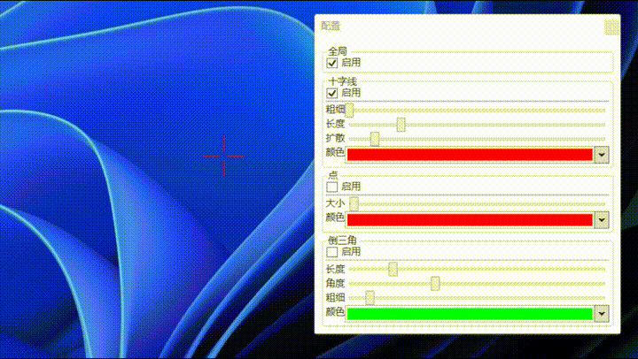

# Crosshair

Crosshair 是一个简单准星程序

## 使用

### 必要条件

- [.NET 6 桌面运行时](https://dotnet.microsoft.com/zh-cn/download/dotnet/6.0)

### 下载运行

1. 从 [Release](https://github.com/fissssssh/Crosshair/releases) 下载
2. 解压到任意位置，双击运行
3. 单击托盘图标可进行准星配置或退出程序

## 功能

目前支持三种准星： 十字线， 点， 倒三角

准星均支持设置颜色和开关，同时不同的准星支持不同的特殊配置：

- 十字线
  - 长度
  - 扩散
  - 粗细
- 点
  - 大小
- 倒三角
  - 角度
  - 长度
  - 粗细

## 贡献

欢迎 PR

## 开源许可

MIT License
